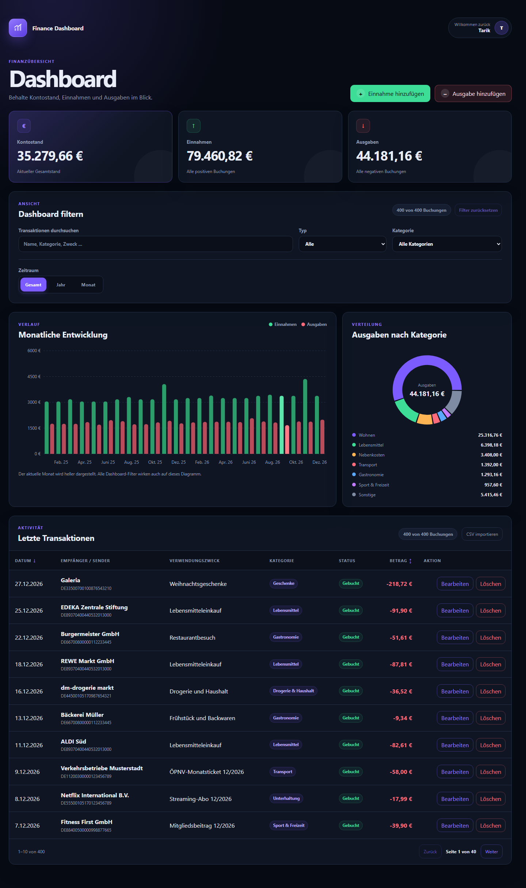

# Finance Dashboard

Fullstack-Dashboard zum Erfassen, Filtern und Auswerten synthetischer
Banktransaktionen. React stellt die Oberfläche dar, FastAPI liefert die REST-API
und PostgreSQL speichert die Daten.

**Live-Demo:** [Finance Dashboard öffnen](https://finance-dashboard-ptbf.onrender.com)  
**API-Dokumentation:** [Swagger UI öffnen](https://finance-dashboard-api-rs1u.onrender.com/docs)



## Funktionen

- Transaktionen anlegen, bearbeiten und löschen
- Suche, Filter, Sortierung und Pagination
- Kennzahlen und Diagramme nach Monat, Jahr und Kategorie
- CSV-Import mit Prüfung und Duplikaterkennung
- Responsive und per Tastatur bedienbare Oberfläche
- Automatisierte Backend-, React- und Playwright-Tests

## Stack

React, Vite, JavaScript, FastAPI, Pandas, Psycopg und PostgreSQL.

## Lokal starten

Voraussetzungen: Python 3.14, Node.js 24 und PostgreSQL.

```bash
python -m venv .venv
```

```powershell
# Windows
.venv\Scripts\Activate.ps1
```

```bash
# macOS/Linux
source .venv/bin/activate
```

```bash
python -m pip install -r requirements-dev.txt
npm --prefix frontend ci
```

`.env.example` nach `.env` kopieren und die PostgreSQL-Zugangsdaten eintragen.
Danach Schema und Beispieldaten laden:

```bash
python data/bootstrap_database.py
python data/seed_database.py --apply
```

Backend starten:

```bash
python -m uvicorn src.backend.main:app --reload
```

Frontend in einem zweiten Terminal starten:

```bash
npm --prefix frontend run dev
```

- Dashboard: [http://localhost:5173](http://localhost:5173)
- API-Dokumentation: [http://127.0.0.1:8000/docs](http://127.0.0.1:8000/docs)

## Tests

```bash
python -m unittest discover -s tests -v
npm --prefix frontend test
npm --prefix frontend run lint
npm --prefix frontend run build
npm --prefix frontend exec -- playwright install chromium
npm --prefix frontend run test:e2e
```

Die E2E-Tests verwenden eine eigene temporäre PostgreSQL-Datenbank. Die
Entwicklungsdaten werden dabei nicht verändert.

## Deployment

`render.yaml` enthält die Konfiguration für Frontend und API. Für die
öffentliche Demo werden nur drei Werte benötigt:

1. Eine Neon-Verbindungsadresse als `DATABASE_URL`
2. Die Frontend-Adresse als `CORS_ORIGINS`
3. Die API-Adresse als `VITE_API_BASE_URL`

Mit `DEMO_MODE=true` wird die öffentliche Datenbank bei jedem Backend-Start auf
die synthetischen Beispieldaten von 2025 und 2026 zurückgesetzt.
